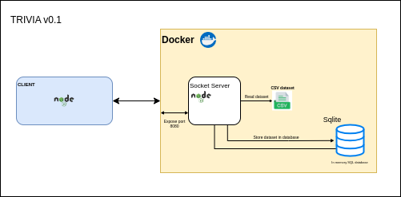

# trivia

Application developed during a task of discipline C115, from the National Telecommunications Institute ([INATEL](https://inatel.br/home/)), taught by Professor Samuel Baraldi

- This is a simple client-server application, using sockets, where you receive 3 multiple choice questions and, after answering them, you can check your successes and errors

- In this version, this [dataset](https://www.kaggle.com/datasets/thedevastator/new-commonsenseqa-dataset-for-multiple-choice-qu?resource=download) was used and its data was converted to the application database

The following image shows the application architecture:

